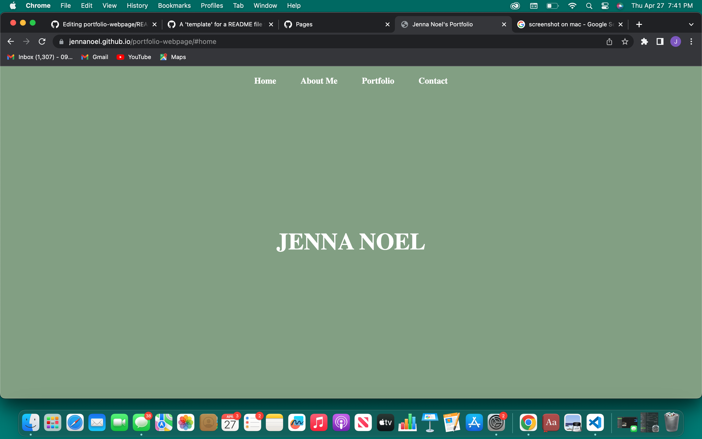
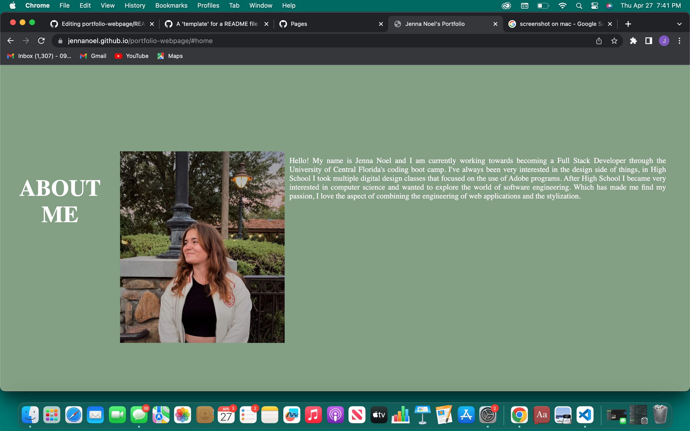
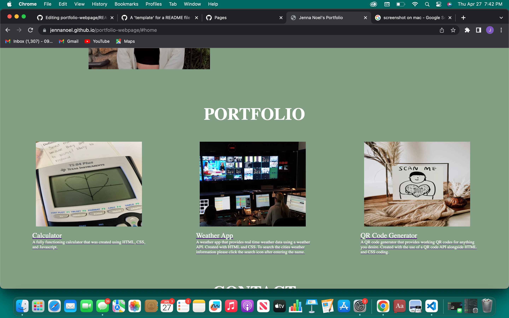
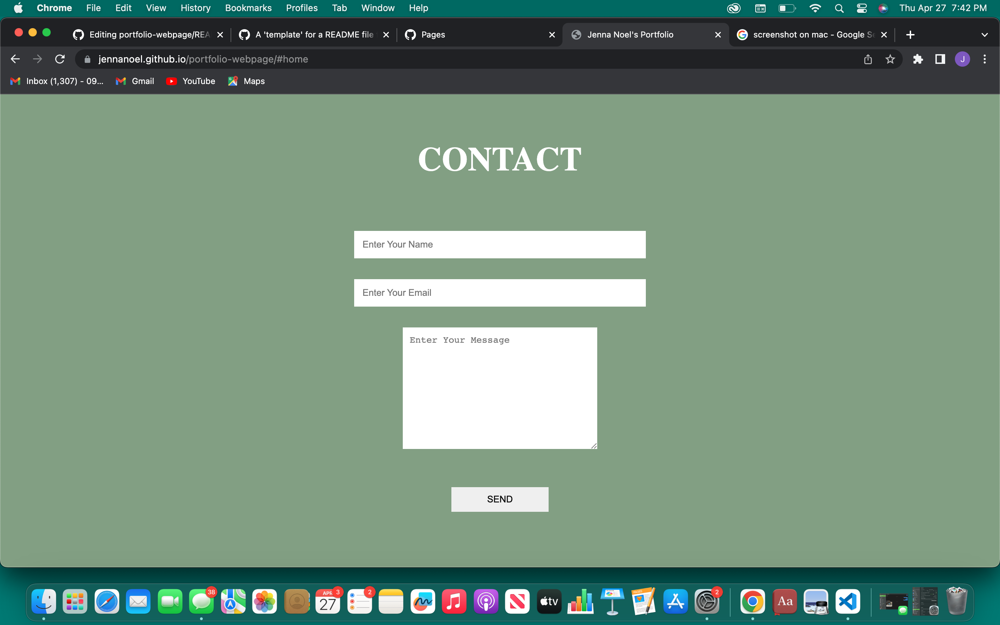

# Portfolio-Webpage
A webpage displaying my current deployed projects and a section introducing myself.

## Built With
I used HTML and CSS to create my portfolio, I am using Github Pages to deploy the site at the moment. All projects displayed on the portfolio were created with HTML, CSS, and JavaScript.

## Features
The navigation bar at the top will scroll down to the section you click on. The webpage can be viewed on a screen as small as a typical phone, the information will properly re-arrange to fit the screen.

## Visuals
The four sections should appear like this when deployed:

  
  
  
  
  ## Deployment
  The following link will take you to the deployed site:
  https://jennanoel.github.io/portfolio-webpage/#portfolio
  

